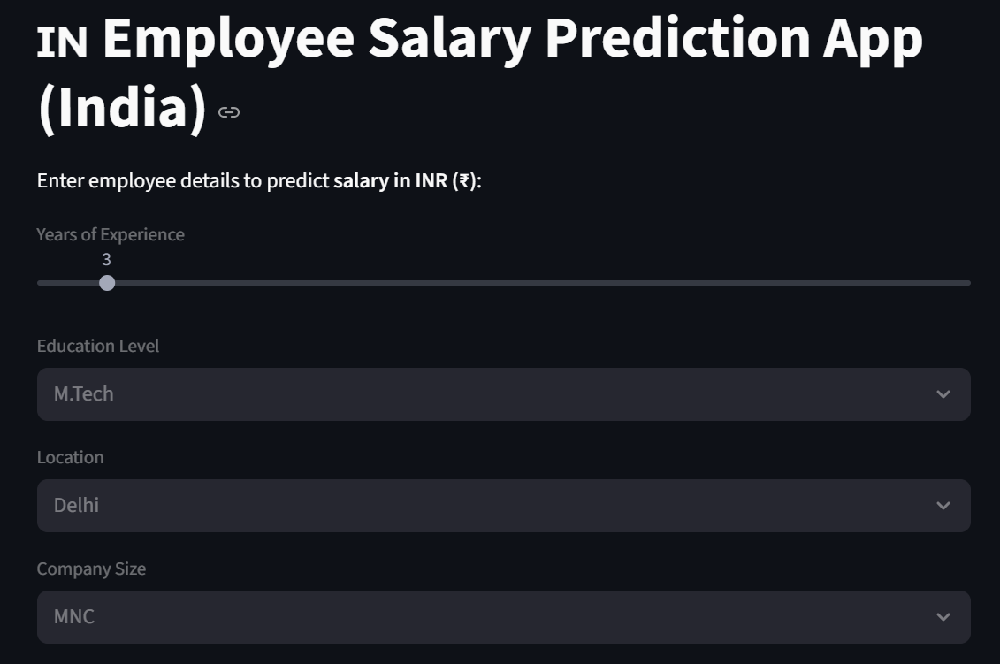
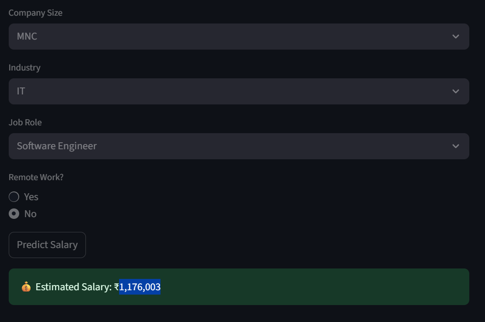

# IN Employee Salary Prediction App (India)

A web application to predict employee salaries in India (in INR ₹) based on user input such as years of experience, education level, location, company size, industry, job role, and remote work status. Built with Streamlit and machine learning.

---

## Features
- Predicts estimated salary for Indian employees
- User-friendly web interface (see screenshots below)
- Input fields for:
  - Years of Experience (slider)
  - Education Level (dropdown)
  - Location (dropdown)
  - Company Size (dropdown)
  - Industry (dropdown)
  - Job Role (dropdown)
  - Remote Work (radio button)
- Displays estimated salary in INR with formatting
- Dark mode UI for better readability

---

## Screenshots




---

## Getting Started

### Prerequisites
- Python 3.7+
- pip (Python package manager)

### Installation
1. **Clone the repository or download the files**
2. **Install dependencies:**
   ```bash
   pip install streamlit pandas scikit-learn
   ```
   (Add any other dependencies your `app.py` uses)

### Running the App
Run the following command in your terminal:
```bash
streamlit run app.py
```

The app will open in your default web browser.

---

## File Structure
- `app.py` : Main Streamlit application
- `employee_salaries.csv` : Dataset used for training/prediction

---

## Usage
1. Enter/select the required employee details in the form.
2. Click **Predict Salary**.
3. The estimated salary will be displayed at the bottom.

---

## Model & Data
- The app uses a machine learning model (see `app.py`) trained on the `employee_salaries.csv` dataset.
- Features used: Experience, Education, Location, Company Size, Industry, Job Role, Remote Work
- Model type: (Specify here, e.g., Linear Regression, Random Forest, etc. If not sure, check your `app.py`)

---

## Customization
- To update the dataset, replace `employee_salaries.csv` with your own data (ensure the format matches).
- To change model logic, edit `app.py`.

---

## Troubleshooting
- **Session state warning:** Always run the app with `streamlit run app.py` to avoid warnings.
- **Module not found:** Ensure all required packages are installed.
- **App not loading:** Check terminal for errors and resolve missing dependencies.

---

## License
Specify your license here (e.g., MIT, Apache 2.0, etc.)

---

## Credits
- Developed by [Your Name]
- Powered by Streamlit, scikit-learn, pandas

---

## Contact
For questions or support, contact [your-email@example.com]
